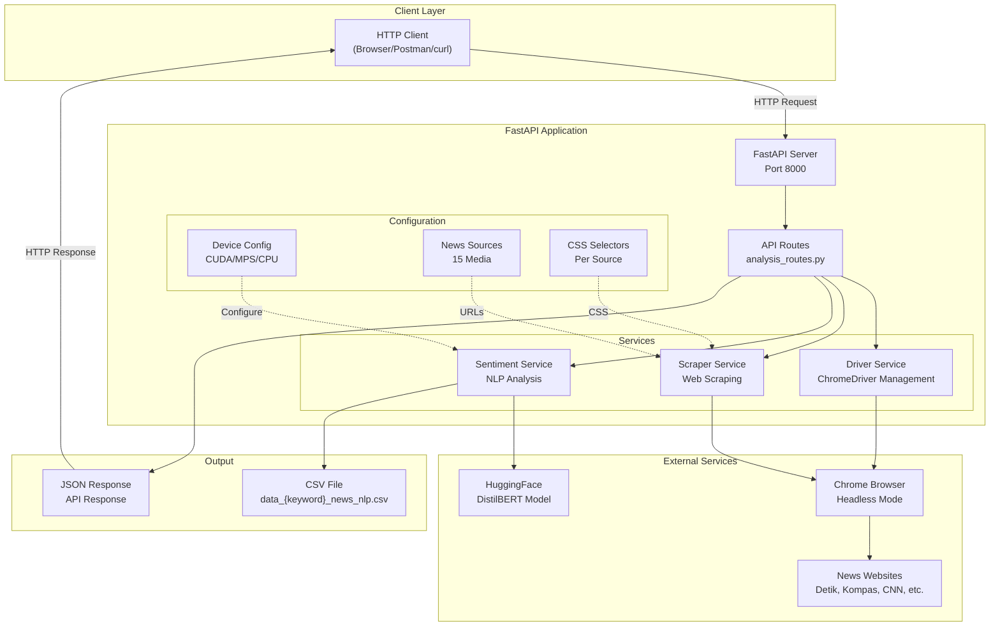
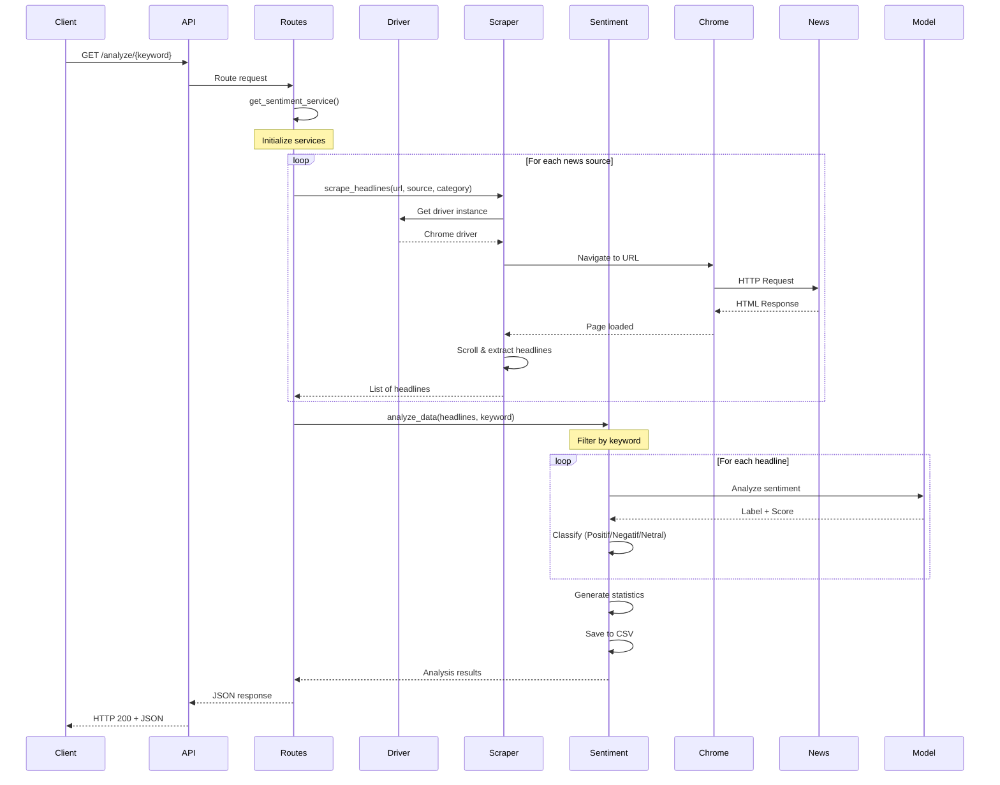
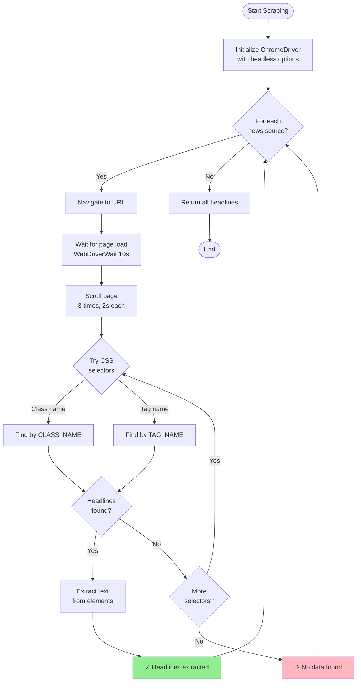
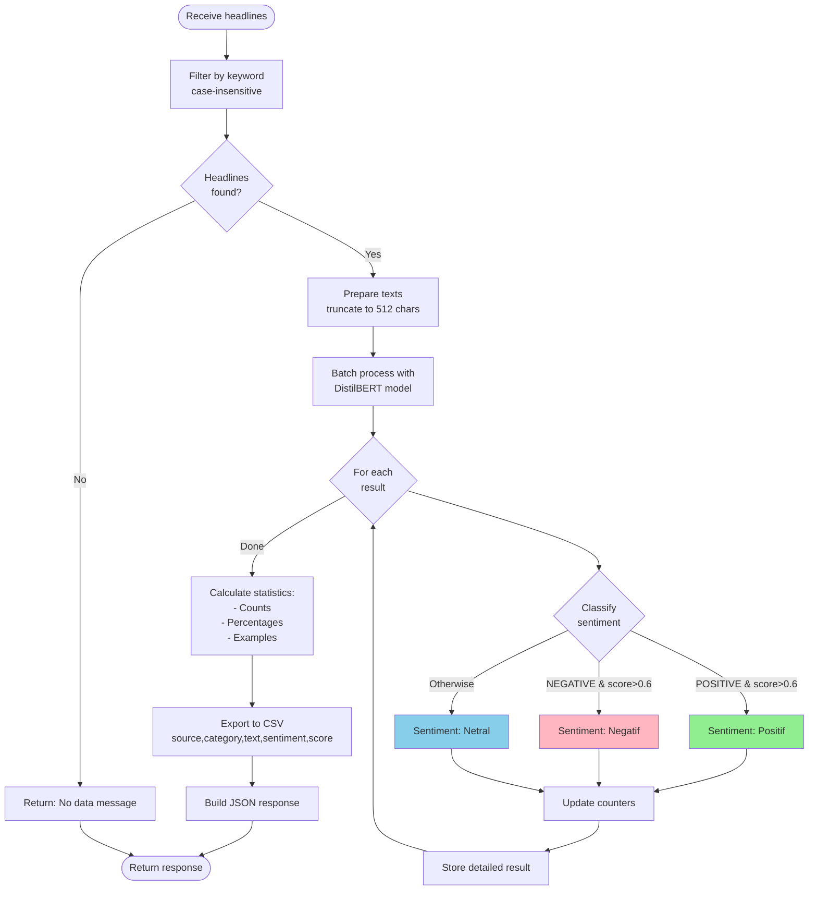
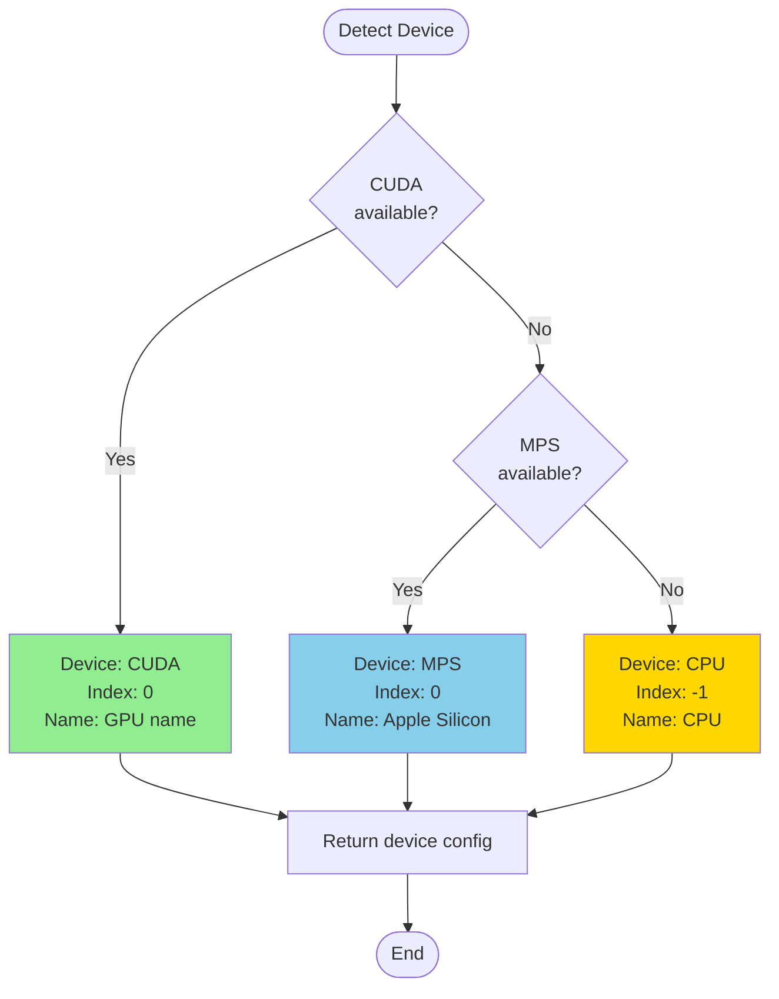
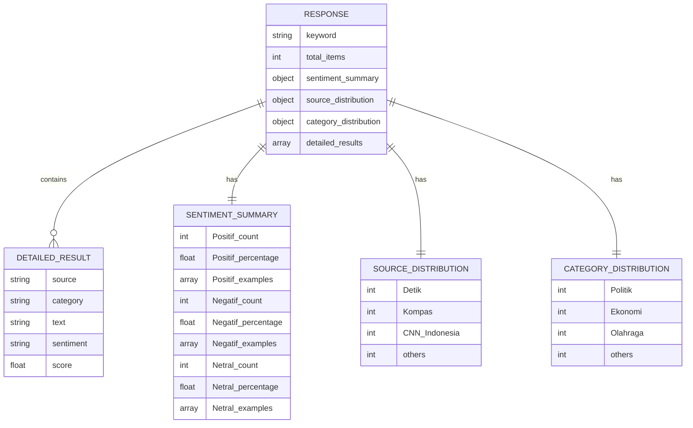
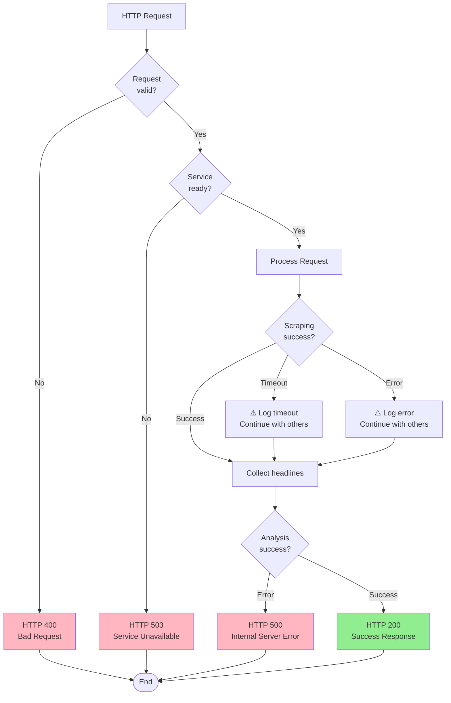

# 📰 News Sentiment Analysis API

API analisis sentimen berita Indonesia menggunakan FastAPI, Selenium, dan DistilBERT untuk menganalisis sentimen dari berbagai sumber berita terkemuka.

[](https://www.python.org/downloads/)
[](https://fastapi.tiangolo.com/)
[](LICENSE)

## 🌟 Fitur

- ✅ **Web Scraping Otomatis** - Mengambil berita dari 15 sumber media terkemuka Indonesia
- ✅ **Analisis Sentimen NLP** - Menggunakan DistilBERT multilingual untuk analisis sentimen
- ✅ **Multi-Platform Support** - Mendukung CUDA (NVIDIA), MPS (Apple Silicon), dan CPU
- ✅ **Auto ChromeDriver** - Download dan setup ChromeDriver otomatis
- ✅ **Export CSV** - Hasil analisis dalam format CSV untuk analisis lebih lanjut
- ✅ **REST API** - Interface API yang mudah digunakan dengan dokumentasi interaktif
- ✅ **Modular Architecture** - Kode terstruktur dan mudah di-maintain

## 📊 Sumber Berita

API ini mengambil berita dari 15 media terkemuka:

- **Detik** - Terpopuler, Otomotif, Politik, Ekonomi, Olahraga, Teknologi, Hiburan
- **Kompas** - Tren, Otomotif, Politik, Ekonomi, Olahraga, Teknologi, Hiburan
- **CNN Indonesia** - Nasional, Otomotif, Politik, Ekonomi, Olahraga, Teknologi, Hiburan
- **Tempo** - Terpopuler, Otomotif, Politik, Ekonomi, Olahraga, Teknologi, Hiburan
- **Tribunnews** - Populer, Otomotif, Politik, Ekonomi, Olahraga, Teknologi, Hiburan
- **Liputan6** - News, Otomotif, Politik, Ekonomi, Olahraga, Teknologi, Hiburan
- **Republika** - Terpopuler, Otomotif, Politik, Ekonomi, Olahraga, Teknologi, Islam
- **Okezone** - Beranda, Otomotif, Politik, Ekonomi, Olahraga, Teknologi, Hiburan
- **Suara** - Terpopuler, Otomotif, Politik, Ekonomi, Olahraga, Teknologi, Hiburan
- **Viva** - Berita, Otomotif, Politik, Ekonomi, Olahraga, Teknologi, Hiburan
- **Sindonews** - Nasional, Otomotif, Ekonomi, Olahraga, Teknologi, Hiburan
- **Antara News** - Nasional, Ekonomi, Olahraga, Teknologi, Hiburan
- **Bisnis.com** - Ekonomi, Otomotif, Teknologi, Hiburan
- **Jawa Pos** - Nasional, Ekonomi, Olahraga, Teknologi, Hiburan
- **BBC Indonesia** - Berita, Internasional, Teknologi

## 🏗️ Arsitektur

```
Fastapi/
├── config/              # Konfigurasi aplikasi
│   ├── device_config.py # Deteksi device (CUDA/MPS/CPU)
│   └── news_sources.py  # Konfigurasi sumber berita
├── services/            # Business logic
│   ├── driver_service.py    # ChromeDriver management
│   ├── scraper_service.py   # Web scraping
│   └── sentiment_service.py # Analisis sentimen
├── utils/               # Utilities
│   └── selectors.py     # CSS selectors
├── routes/              # API endpoints
│   └── analysis_routes.py
├── main.py              # Entry point
└── requirements.txt     # Dependencies
```

## 📊 Diagram Sistem

### 1. Arsitektur Sistem



### 2. Flow Analisis Sentimen



### 3. Proses Scraping Detail



### 4. Analisis Sentimen Detail



### 5. Device Detection Flow



### 6. Data Model



### 7. Error Handling




## 🚀 Quick Start

### Prerequisites

- Python 3.8 atau lebih tinggi
- Google Chrome browser (untuk ChromeDriver)

### Instalasi

1. Clone repository:
```bash
git clone <repository-url>
cd sentimen_analysis/Fastapi
```

2. Install dependencies:
```bash
pip install -r requirements.txt
```

3. Jalankan server:
```bash
python main.py
```

Server akan berjalan di `http://localhost:8000`

## 🧪 Testing

### Menjalankan Server Lokal

1. **Start server**:
```bash
cd /Users/raihansetiawan/sentimen_analysis/Fastapi
python main.py
```

Output yang diharapkan:
```
MPS tersedia. Menggunakan perangkat: Apple Silicon (MPS)
Menyiapkan ChromeDriver...
ChromeDriver siap digunakan!
Memuat model sentiment analysis...
Model sentiment analysis siap!
Aplikasi siap digunakan!
INFO:     Application startup complete.
INFO:     Uvicorn running on http://0.0.0.0:8000 (Press CTRL+C to quit)
```

2. **Buka Interactive Documentation**:

Buka browser dan akses:
```
http://localhost:8000/docs
```

Anda akan melihat Swagger UI dengan:
- ✅ Daftar semua endpoint
- ✅ Try it out button untuk testing langsung
- ✅ Request/Response examples
- ✅ Schema definitions


3. **Test API dari Browser**:

**Root Endpoint**:
```
http://localhost:8000/
```

**Analyze Endpoint** (contoh dengan keyword "politik"):
```
http://localhost:8000/analyze/politik
```

4. **Test dengan curl**:

```bash
# Test root endpoint
curl http://localhost:8000/

# Test analyze endpoint
curl http://localhost:8000/analyze/teknologi

# Save response to file
curl http://localhost:8000/analyze/ekonomi > result.json
```

5. **Test dengan Postman**:

- Method: `GET`
- URL: `http://localhost:8000/analyze/pemerintah`
- Headers: (tidak diperlukan)
- Send request

6. **Cek Output CSV**:

Setelah request selesai, cek file CSV yang dihasilkan:
```bash
ls -lh data_*_news_nlp.csv
cat data_politik_news_nlp.csv | head -10
```

### Testing Checklist

- [ ] Server berhasil start tanpa error
- [ ] Docs page (`/docs`) dapat diakses
- [ ] Root endpoint (`/`) mengembalikan response
- [ ] Analyze endpoint berhasil scraping berita
- [ ] File CSV ter-generate dengan benar
- [ ] Response JSON memiliki struktur yang benar
- [ ] ChromeDriver berjalan dalam headless mode
- [ ] Model sentiment analysis ter-load

### Troubleshooting Testing

**Port sudah digunakan**:
```bash
# Kill process di port 8000
lsof -ti:8000 | xargs kill -9

# Atau gunakan port lain
uvicorn main:app --port 8001
```

**ChromeDriver error**:
```bash
# Reinstall ChromeDriver
pip uninstall webdriver-manager
pip install webdriver-manager
```

**Model download lambat**:
```bash
# Model akan di-download otomatis saat pertama kali
# Tunggu hingga selesai (sekitar 1-2 menit)
# Model akan di-cache untuk penggunaan selanjutnya
```

## 📖 Penggunaan

### API Endpoints

#### 1. Root Endpoint
```bash
GET http://localhost:8000/
```

Response:
```json
{
  "message": "News Sentiment Analysis API",
  "endpoints": {
    "analyze": "/analyze/{keyword}"
  }
}
```

#### 2. Analisis Sentimen
```bash
GET http://localhost:8000/analyze/{keyword}
```

Contoh:
```bash
curl http://localhost:8000/analyze/politik
```

Response:
```json
{
  "keyword": "politik",
  "total_items": 150,
  "sentiment_summary": {
    "Positif": {
      "count": 45,
      "percentage": 30.0,
      "examples": [...]
    },
    "Negatif": {
      "count": 30,
      "percentage": 20.0,
      "examples": [...]
    },
    "Netral": {
      "count": 75,
      "percentage": 50.0,
      "examples": [...]
    }
  },
  "source_distribution": {...},
  "category_distribution": {...},
  "detailed_results": [...]
}
```

#### 3. Interactive Documentation
```bash
http://localhost:8000/docs
```

### Output CSV

Hasil analisis otomatis disimpan dalam file CSV:
```
data_{keyword}_news_nlp.csv
```

Format CSV:
```csv
source,category,text,sentiment,score
Detik,Politik,"Judul berita...",Positif,0.95
CNN Indonesia,Ekonomi,"Judul lain...",Netral,0.75
```

## 🔧 Konfigurasi

### Device Configuration

Aplikasi otomatis mendeteksi device terbaik:
- **CUDA** - Untuk GPU NVIDIA
- **MPS** - Untuk Apple Silicon (M1/M2/M3)
- **CPU** - Fallback untuk sistem tanpa GPU

### ChromeDriver Options

ChromeDriver berjalan dalam headless mode dengan konfigurasi:
- `--headless=new` - Mode headless
- `--no-sandbox` - Untuk stabilitas
- `--disable-gpu` - Optimasi
- `--window-size=1920,1080` - Resolusi
- Custom user-agent untuk anti-detection

## 📊 Teknologi

- **FastAPI** - Modern web framework untuk Python
- **Selenium** - Web scraping automation
- **webdriver-manager** - Auto ChromeDriver management
- **Transformers** - HuggingFace library untuk NLP
- **DistilBERT** - Multilingual sentiment analysis model
- **PyTorch** - Deep learning framework

## 🎯 Use Cases

1. **Monitoring Brand** - Analisis sentimen publik terhadap brand/produk
2. **Riset Politik** - Analisis opini publik terhadap isu politik
3. **Analisis Pasar** - Sentimen berita ekonomi dan bisnis
4. **Media Monitoring** - Tracking coverage berita dari berbagai sumber
5. **Research** - Data untuk penelitian sentimen media

## 📈 Performance

- **Scraping Speed**: ~2-3 detik per sumber berita
- **Analysis Speed**: Tergantung device (GPU > CPU)
- **Concurrent Requests**: Mendukung multiple requests
- **Accuracy**: ~85-90% (tergantung kualitas data)

## 🛠️ Development

### Menambah Sumber Berita

Edit `config/news_sources.py`:
```python
NEWS_SOURCES = {
    "Nama Media": {
        "Kategori": "https://url-kategori.com"
    }
}
```

Edit `utils/selectors.py`:
```python
SELECTORS = {
    "Nama Media": ["css-selector-1", "css-selector-2"]
}
```

### Testing

```bash
# Test scraping
curl http://localhost:8000/analyze/test

# Check logs
tail -f logs/app.log
```

## 🐛 Troubleshooting

### ChromeDriver Issues
```bash
# Reinstall ChromeDriver
pip uninstall webdriver-manager
pip install webdriver-manager
```

### Port Already in Use
```bash
# Kill process on port 8000
lsof -ti:8000 | xargs kill -9
```

### Model Download Issues
```bash
# Clear cache and retry
rm -rf ~/.cache/huggingface/
```

## 📝 License

MIT License - lihat file [LICENSE](LICENSE) untuk detail.

## 👥 Contributing

Contributions are welcome! Please feel free to submit a Pull Request.

1. Fork the project
2. Create your feature branch (`git checkout -b feature/AmazingFeature`)
3. Commit your changes (`git commit -m 'Add some AmazingFeature'`)
4. Push to the branch (`git push origin feature/AmazingFeature`)
5. Open a Pull Request

## 📧 Contact

Untuk pertanyaan atau saran, silakan buka issue di repository ini.

## 🙏 Acknowledgments

- [HuggingFace](https://huggingface.co/) untuk model DistilBERT
- [FastAPI](https://fastapi.tiangolo.com/) untuk framework
- [Selenium](https://www.selenium.dev/) untuk web scraping tools
- Semua sumber berita yang datanya digunakan

---

**Note**: Aplikasi ini dibuat untuk tujuan edukasi dan riset. Pastikan untuk mematuhi terms of service dari setiap sumber berita yang di-scrape.
