# News Sentiment Analysis API - System Documentation

Dokumentasi lengkap sistem analisis sentimen berita dengan diagram Mermaid.

---

## 1. Arsitektur Sistem

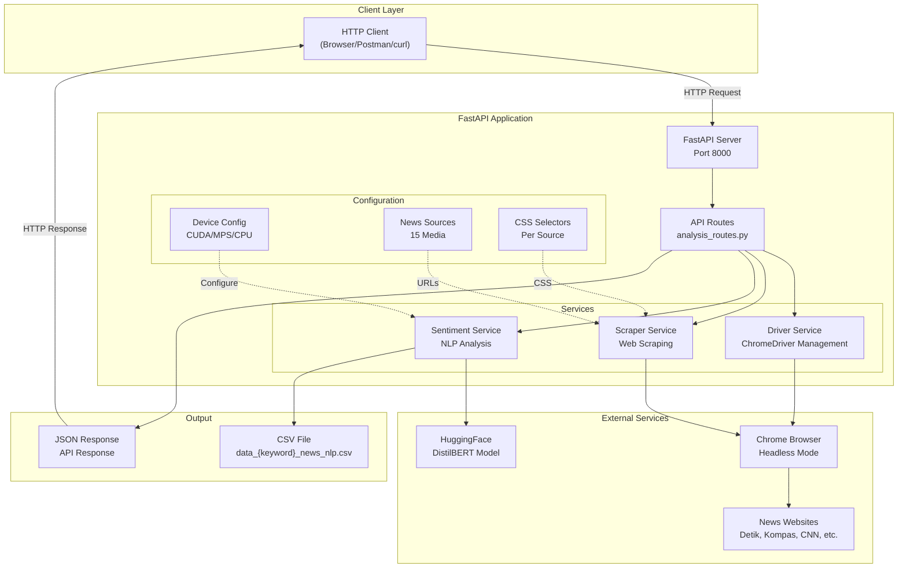

---

## 2. Struktur Folder

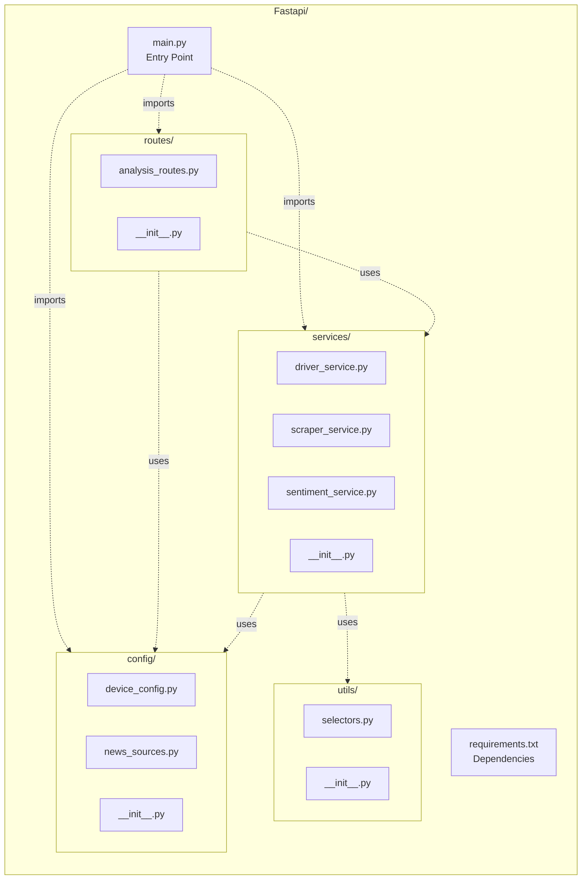

---

## 3. Flow Analisis Sentimen

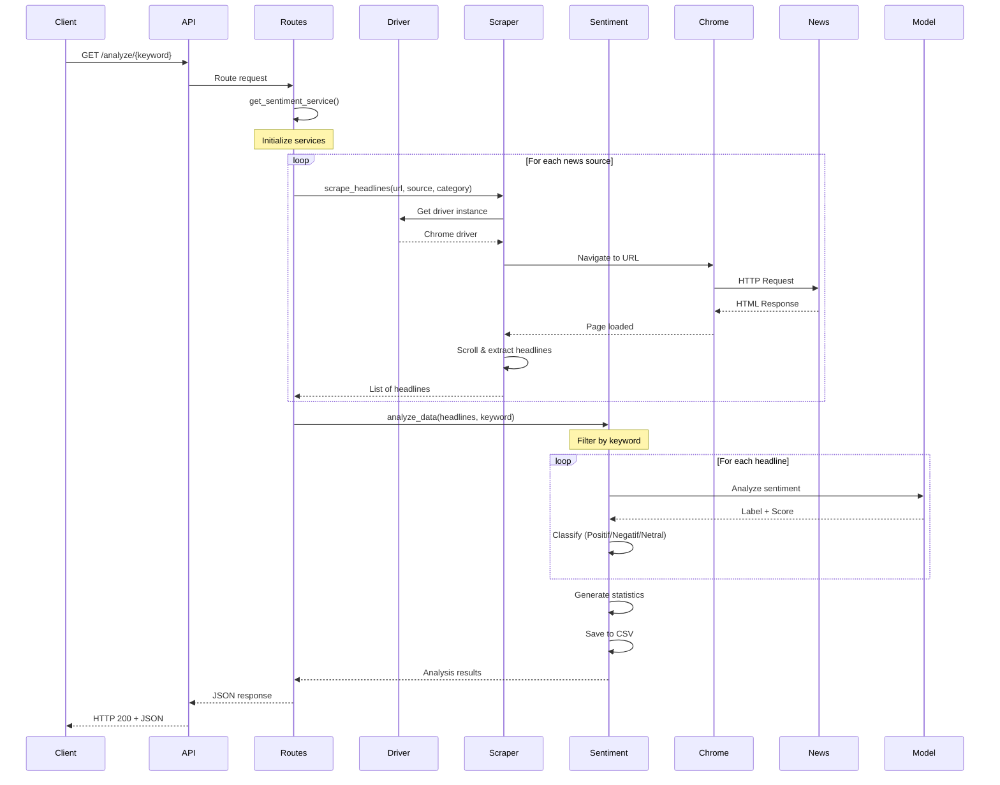

---

## 4. Proses Scraping Detail

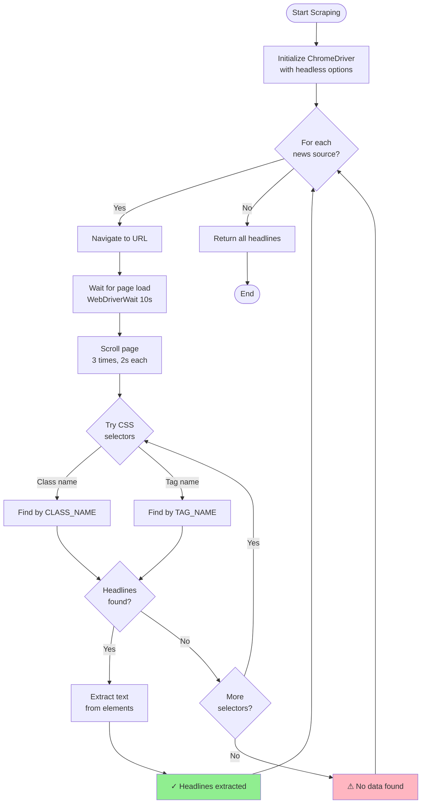

---

## 5. Analisis Sentimen Detail

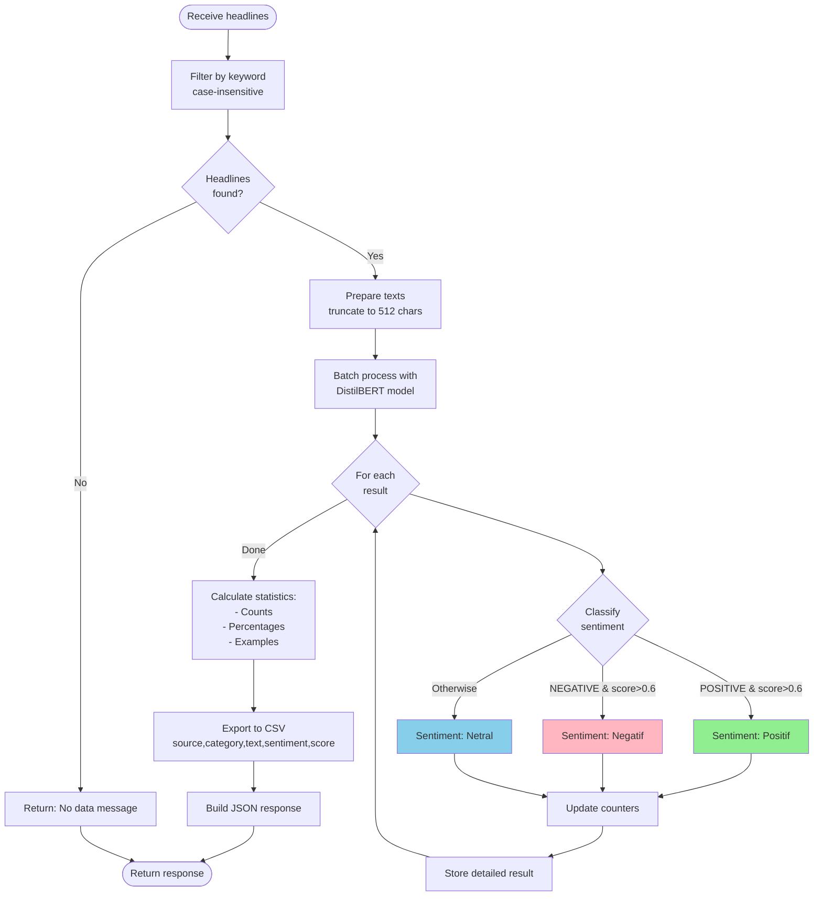

---

## 6. Dependency Injection Pattern

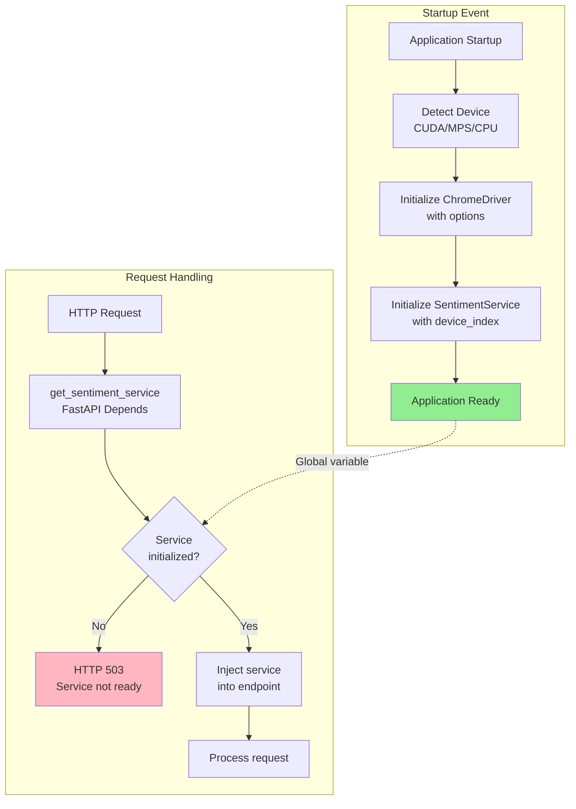

---

## 7. Device Detection Flow

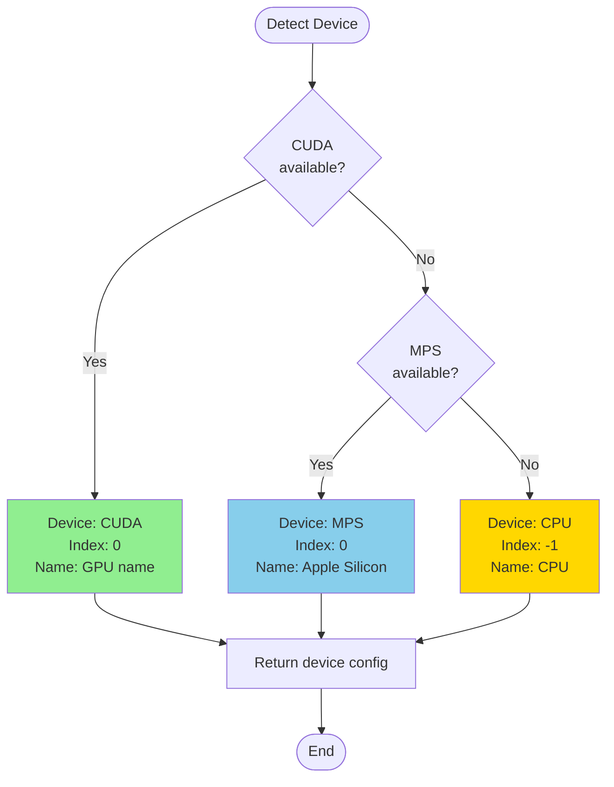

---

## 8. ChromeDriver Options

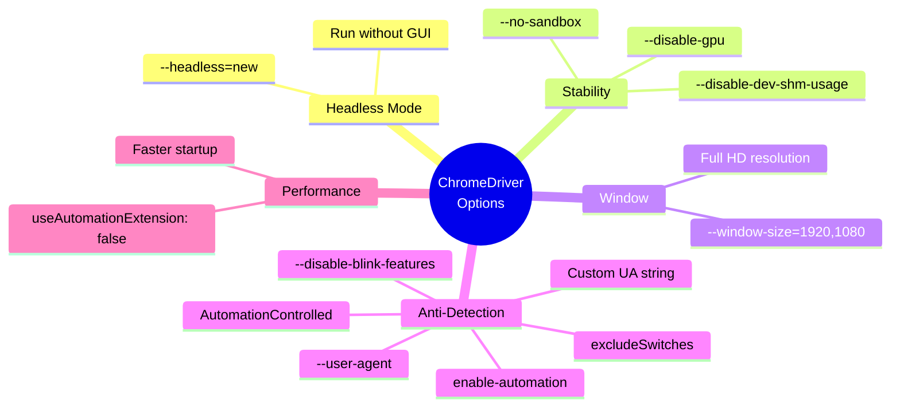

---

## 9. Data Model

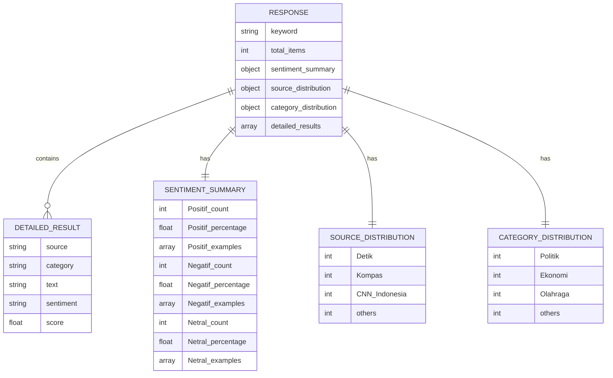

---

## 10. API Endpoints

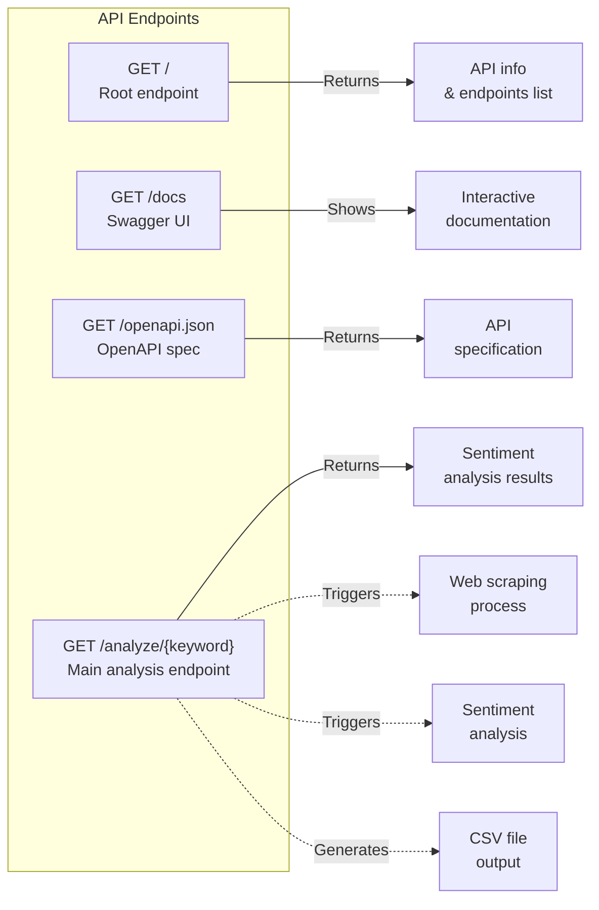

---

## 11. Error Handling

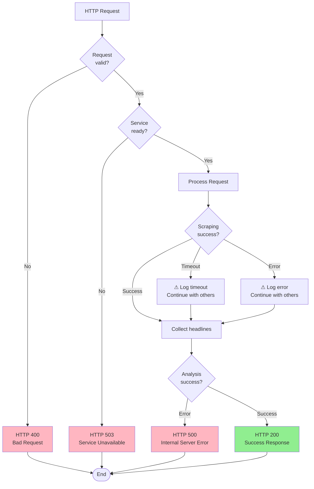

---

## 12. Deployment Architecture

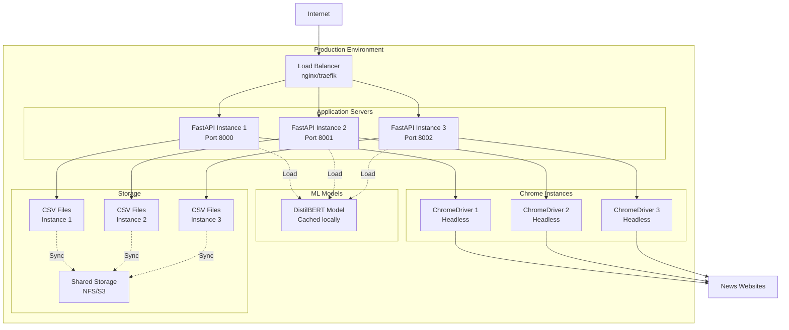

---

## Summary

Sistem ini menggunakan:
- **FastAPI** untuk REST API
- **Selenium + ChromeDriver** untuk web scraping
- **DistilBERT** untuk analisis sentimen
- **Modular architecture** untuk maintainability
- **Dependency injection** untuk service management
- **Multi-platform support** (CUDA/MPS/CPU)
- **CSV export** untuk hasil analisis
